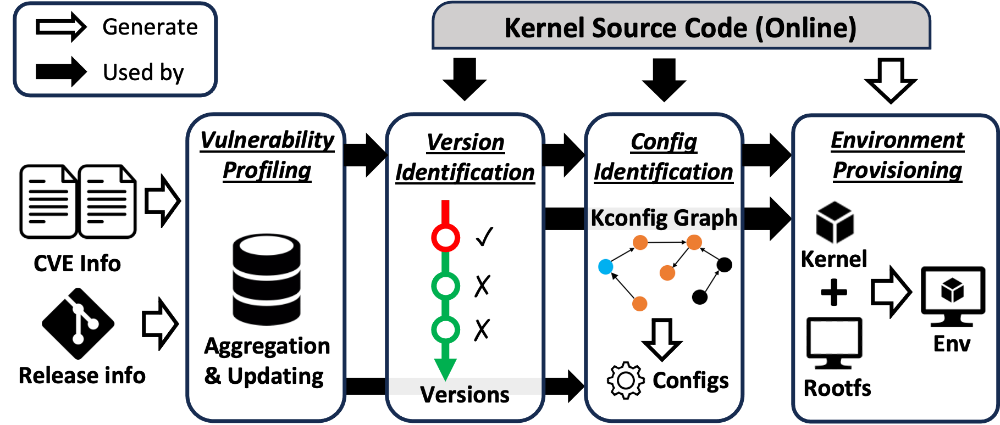

<p align="center">
  
</p>

## Introduction

KernJC (Kernel [JiaoChang](https://zh-wiktionary-org.translate.goog/wiki/%E6%A0%A1%E5%A0%B4?_x_tr_sl=zh-CN&_x_tr_tl=en&_x_tr_hl=zh-CN&_x_tr_pto=wapp) /dʒaʊ tʃɑ:ŋ/) is a vulnerability reproduction tool for Linux kernel. The goal of KernJC is to construct reproducible environments for Linux kernel vulnerabilities, where the **real** vulnerable kernel version is compiled with the **correct** kernel configs to make the vulnerability **available** and **triggerable**.

Main Features:

1. Auto-detect and avoid spurious vulnerable version claims from online databases (e.g., NVD).
2. Auto-resolve vulnerability related kernel config dependencies.
3. Docker-like interface for vulnerability reproduction process management.
4. Incremental update of local knowledge base (Information of vulnerabilities and patches).

## Workflow

The workflow of KernJC is shown as below:



You can refer to [KernJC paper](https://arxiv.org/abs/2404.11107) for more details.

<!--  -->

## Installation

KernJC is designed to run on Linux hosts with Intel/AMD CPUs. Currently only Ubuntu distributions are tested. The KernJC itself does not require distribution specific features (e.g., package management), but the `tools/create-image.sh` script (from [syzkaller](https://github.com/google/syzkaller/blob/master/docs/linux/setup_ubuntu-host_qemu-vm_x86-64-kernel.md) project) to build the base root filesystem image is distribution specific. If you are using other distributions, you may need to modify the script to make it work.

Install system-level dependencies:

```bash
sudo apt-get install -y git build-essential libssl-dev libncurses5-dev flex bison libelf-dev qemu-system qemu-utils gcc g++ make python3 python3-pip debootstrap gcc-multilib bc
pip3 install virtualenv
```

Clone the repository and install dependencies:

```bash
# Python >= 3.9 is required
git clone https://github.com/NUS-Curiosity/KernJC
cd KernJC
virtualenv -p /usr/bin/python3 venv
source venv/bin/activate
pip install -r requirements.txt
```

Then run the following command for initialization:

```bash
cp config.yaml.tmpl config.yaml
# run kjc to initialize dirs
./kjc update
# build base root filesystem image
cd tools/
./create-image.sh
```

Note that you need to input your own NVD API key in `config.yaml` to enable database updating. If you do not have an NVD API key, you can apply for one [here](https://nvd.nist.gov/vuln/data-feeds#JSON_FEED).

## Quick Start

Build a vulnerable environment for CVE-2016-10150:

```console
$ ./kjc build CVE-2016-10150
[*] Removing potential FP versions for CVE-2016-10150
[+] Auto-selected kernel version: 4.8.12
[*] Initializing env
[*] Downloading 4.8.12 kernel source code
    100%|████████████████████████████████████████████134/134
[*] Decompressing kernel source code
[*] Building kernel source code
[*] Applying custom config
[*] Loading default custom config
[*] Generating potential configs based on kcfg graph
[*] Finding kernel configs for CVE-2016-10150 in env a30ebfa6f5747fa9
[*] Building kcfg graph for env a30ebfa6f5747fa9
[+] Built kcfg graph (12050 nodes, 21525 edges)
[+] Found 37 potential configs based on kcfg graph
[*] Loading CVE-2016-10150 related custom config
[!] Vuln config file not found. Using default config.
[*] Merging custom config with .config
[+] Applied custom config
... kernel compilation output omitted ...
[+] Built kernel source code
[*] Preparing rootfs (overlay image)
[+] Env a30ebfa6f5747fa9 created
```

List and inspect the built environment:

```console
$ ./kjc ps -a
+------------------+----------------+--------+---------+
| ID               | CVE            | Kernel | Status  |
+------------------+----------------+--------+---------+
| a30ebfa6f5747fa9 | CVE-2016-10150 | 4.8.12 | stopped |
+------------------+----------------+--------+---------+
$ ./kjc info a3
{'create_time': 1699779548.215992,
 'cve': 'CVE-2016-10150',
 'ip': None,
 'kernel_version': '4.8.12',
 'pid': None,
 'port': None,
 'status': 'stopped'}
```

Start the environment:

```console
$ ./kjc start --enable-kvm a3
[*] Starting env a3
[+] Started env a30ebfa6f5747fa9 (QEMU pid: 60566)
```

Compile the PoC and copy it to the environment:

```console
$ cd db/pocs/cve-2016-10150/; gcc -o poc poc.c -static; cd -
~/pjts/KernJC
$ ./kjc cp db/pocs/cve-2016-10150/poc a3:/home/user/
Warning: Permanently added '[localhost]:10000' (ECDSA) to the list of known hosts.
poc
```

Open a new terminal and monitor the kernel logs:

```console
$ ./kjc logs -f a3
[  OK  ] Reached target Graphical Interface.
         Starting Update UTMP about System Runlevel Changes...
[  OK  ] Finished Update UTMP about System Runlevel Changes.

Debian GNU/Linux 11 kernjc ttyS0
... output omitted ...
```

Add `user` user into `kvm` group (only for CVE-2016-10150):

```console
$ ./kjc attach a3
... output omitted ...
user@kernjc:~$ su # password: neo
Password:
root@kernjc:/home/user# /usr/sbin/adduser user kvm
Adding user `user' to group `kvm' ...
Adding user user to group kvm
Done.
```

Run the PoC in the environment:

```console
$ ./kjc exec a3 /home/user/poc
Warning: Permanently added '[localhost]:10000' (ECDSA) to the list of known hosts.
```

In the kernel logs terminal, we can see the KASAN report:

```console
$ ./kjc logs -f a3
... output omitted ...
[  408.497181] ==================================================================
[  408.498170] BUG: KASAN: use-after-free in kvm_vm_ioctl+0x1150/0x1340 at addr ffff88006b8c9a40
[  408.498170] Read of size 8 by task poc/2983
[  408.498170] CPU: 1 PID: 2983 Comm: poc Tainted: G    B           4.8.12 #1
[  408.498170] Hardware name: QEMU Standard PC (i440FX + PIIX, 1996), BIOS 1.10.2-1ubuntu1 04/01/2014
[  408.498170]  0000000000000097 ffff88006118faf0 ffffffff81bfe5a2 ffff88006cc018c0
[  408.498170]  ffff88006b8c9a20 ffff88006b8c9a60 ffffffff83a46400 ffff88006118fb18
[  408.498170]  ffffffff815c8cbc ffff88006118fba8 ffff88006b8c9a20 ffff88006cc018c0
[  408.498170] Call Trace:
... output omitted ...
```

Stop and remove the environment:

```console
$ ./kjc rm --force a3
[+] Env a30ebfa6f5747fa9 removed
```

Note:

1. You can `./kjc attach ENV_ID` and run the PoC in the shell.
2. You can `./kjc rm --force ENV_ID` to remove the environment without stopping it.
3. PoCs in `db/pocs/` are collected from the Internet. Welcome to contribute more PoCs.
4. In the vuln env, you can `su root` with password `neo` to do privileged operations if needed.
5. Ensure that your local compilation toolchain is compatible with the target kernel version and PoC code. If not, the build process may fail. 
   - It is recommended to setup KernJC in old Ubuntu containers when reproducing old vulnerabilities.

## Usage

You can run `./kjc -h` to see the usage of KernJC:

```console
$ ./kjc -h
usage: kjc [-h] [-v] {update,build,start,stop,attach,exec,cp,logs,rm,ps,enter,info,query} ...

KernJC - A Linux kernel vulnerability reproduction tool

optional arguments:
  -h, --help            show this help message and exit
  -v, --version         show program's version number and exit

subcommands:
  {update,build,start,stop,attach,exec,cp,logs,rm,ps,enter,info,query}
    update              update local knodwledge base
    build               build a vuln env
    start               start a vuln env
    stop                stop a vuln env
    attach              attach to a vuln env
    exec                execute a command in a vuln env
    cp                  copy files between host and a vuln env (ENV_ID:/path/to/file)
    logs                show QEMU logs of a vuln env
    rm                  remove a vuln env
    ps                  list vuln envs
    enter               enter an env dir on host
    info                show info of a vuln env
    query               query a vulnerability
```

## Citation

If you use KernJC, please cite the [following paper](https://arxiv.org/abs/2404.11107):

```
@inproceedings{ruan2024kernjc,
  author = {Ruan, Bonan and Liu, Jiahao and Zhang, Chuqi and Liang, Zhenkai},
  title = {KernJC: Automated Vulnerable Environment Generation for Linux Kernel Vulnerabilities},
  year = {2024},
  isbn = {9798400709593},
  publisher = {Association for Computing Machinery},
  address = {New York, NY, USA},
  url = {https://doi.org/10.1145/3678890.3678891},
  doi = {10.1145/3678890.3678891},
  booktitle = {Proceedings of the 27th International Symposium on Research in Attacks, Intrusions and Defenses},
  pages = {384–402},
  numpages = {19},
  keywords = {Linux Kernel, Reproduction, Vulnerable Environment},
  location = {Padua, Italy},
  series = {RAID '24}
}
```
